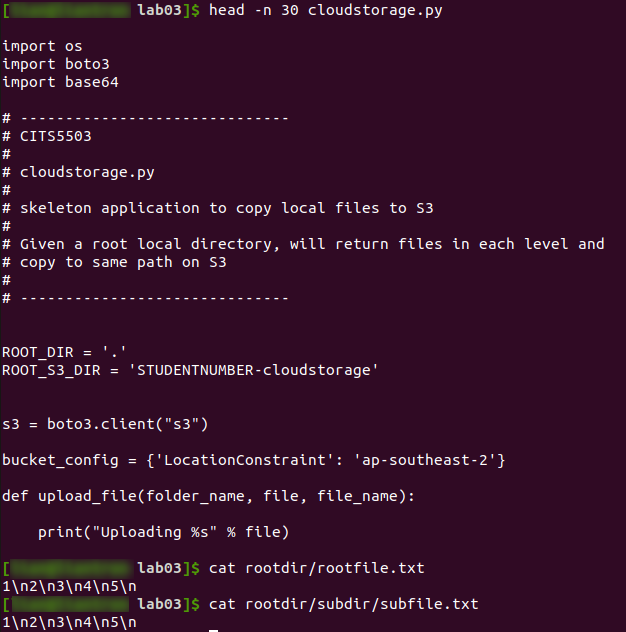
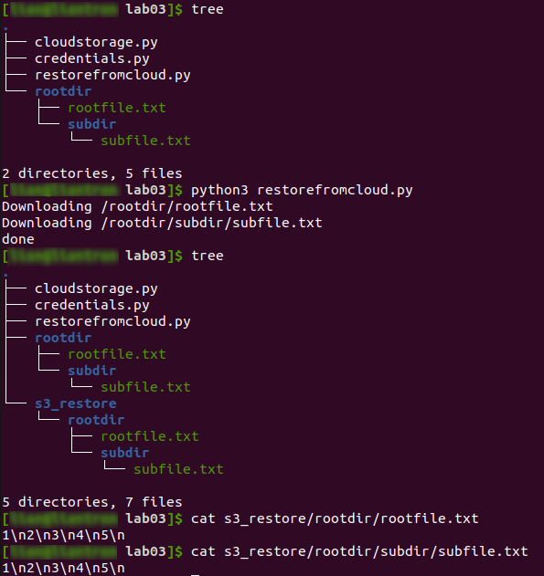
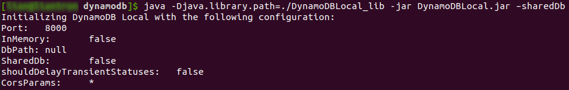
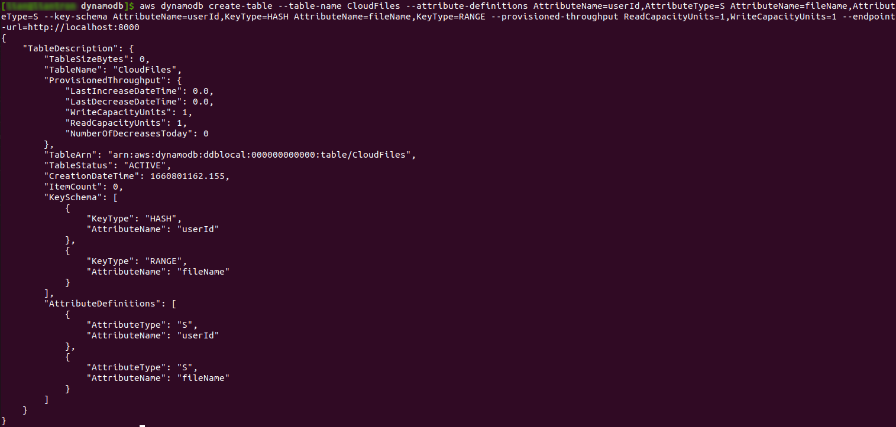
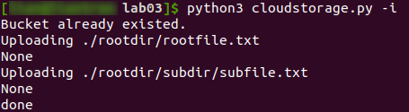
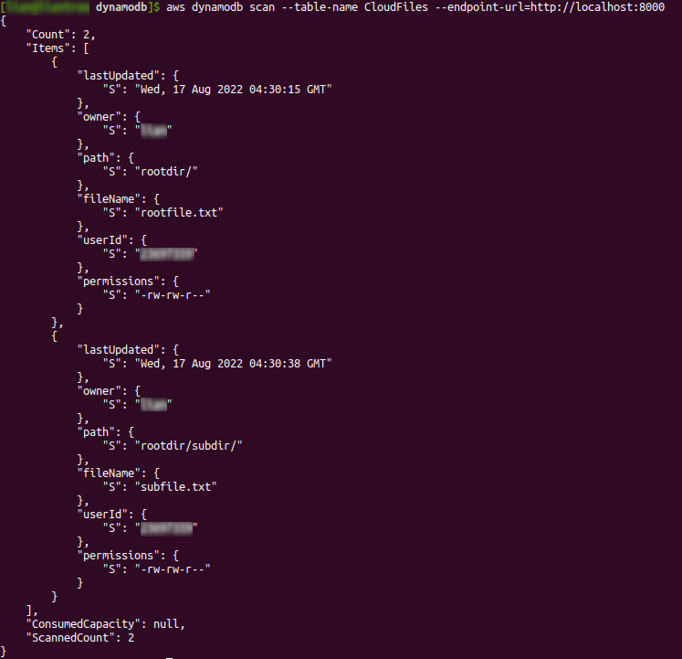

# Practical Worksheet 3

Version: 1.0 Date: 12/04/2018 Author: David Glance

Updated Date: 14/08/2022 Author: Anwarul Patwary

## Learning Objectives

1.	Learn how to create and configure S3 buckets and read and write objects to them
2.	Learn how to use operations on DynamoDB: Create table, put items, get items
3.	Start an application is your own personal Cloud Storage

## Technologies Covered

* Ubuntu
* AWS
* AWS S3
* AWS DynamoDB
* Python/Boto scripts
* VirtualBox

Note: Do this from your VirtualBox VM – if you do it from any other platform (Windows, Mac – you will need to resolve any potential issues yourself)

## Background

The aim of this lab is to write a program that will:

[1] Scan a directory and upload all of the files found in the directory to an S3 bucket, preserving the path information
[2] Store information about each file uploaded to S3 in a DynamoDB
[3] Restore the directory on a local drive using the files in S3 and the information in DynamoDB

## Program

### [Step 1] Preparation

Download the python code cloudstorage.py from https://github.com/dglance/cits5503/blob/master/Labs/src/cloudstorage.py \
Create a directory rootdir \
Create a file in rootdir called rootfile.txt and put some content in it “1\n2\n3\n4\n5\n”

Create a second directory in rootdir called subdir and create another file subfile.txt with the same content as rootfile.txt



### [Step 2] Save to S3

Edit cloudstorage.py to take one argument: -i, --initialise=True – this will use boto to create a bucket on S3 that is identified by \<student number>-cloudstorage

Insert boto commands to save each file that is found as the program traverses the directory starting at the root directory rootdir.

NOTE the easiest way to upload files is to use the command:

```
s3.upload_file()
```

```
import os
import boto3
import botocore.exceptions
import base64
import sys
import credentials as cred

ROOT_DIR = '.'
ROOT_S3_DIR = str(cred.STUD_NR) + '-cloudstorage'

def upload_file(folder_name, file, file_name):
    print("Uploading %s" % file)
    try:
        response = s3.upload_file(Filename=file, Bucket=ROOT_S3_DIR, 
                                  Key="/%s%s" % (folder_name, file_name))
        print(response)
    except Exception as error:
        print("Error: " + str(error))


def create_bucket(bucket_config: dict):
    try:
        response = s3.create_bucket(Bucket=ROOT_S3_DIR, CreateBucketConfiguration=bucket_config)
    except botocore.exceptions.ClientError as error:
        if error.response['Error']['Code'] == 'BucketAlreadyOwnedByYou':
            response = "Bucket already existed."
        else:
            raise error
    print(response)

# parse directory and upload files
def upload_files():
    for dir_name, subdir_list, file_list in os.walk(ROOT_DIR, topdown=True):
        if dir_name != ROOT_DIR and not dir_name.startswith("./__"):
            for fname in file_list:
                print("%s/" % dir_name[2:] + " " +"%s/%s" % (dir_name, fname) + " " + fname)
                upload_file("%s/" % dir_name[2:], "%s/%s" % (dir_name, fname), fname)

    print("done")


if __name__ == '__main__':
    s3 = boto3.client("s3")
    bucket_config = {'LocationConstraint': 'ap-southeast-2'}
    if('-i' in sys.argv or '--initialise=True' in sys.argv):
        create_bucket(bucket_config)
        upload_files()
```


### [Step 3] Restore from S3

Create a new program called restorefromcloud.py that reads the S3 bucket and writes the contents of the bucket within the appropriate directories. You should have a copy of the files and the directories you started with.

```
import os
import boto3
import credentials as cred

ROOT_DIR = '.'
ROOT_S3_DIR = str(cred.STUD_NR) + '-cloudstorage'

def restore_file(file_name: str):
    print("Downloading %s" % file_name)
    filecontent = b''
    try:
        response = s3.get_object(Bucket=ROOT_S3_DIR, Key=file_name)
        filecontent = response['Body']
    except Exception as error:
        print("Error: " + str(error))

    path = './s3_restore' + '/'.join(file_name.split('/')[:-1])

    if not os.path.exists(path):
        os.makedirs(path)
    with open(str("./s3_restore" + file_name), 'w') as file:
        file.write(bytes.decode(filecontent.read()))


def restore_files(owner: str):
    objects_of_bucket = s3.list_objects_v2(Bucket=ROOT_S3_DIR)
    if 'Contents' in objects_of_bucket:
        for content in objects_of_bucket['Contents']:
            restore_file(file_name=content['Key'], owner=owner)
    print("done")


if __name__ == '__main__':
    s3 = boto3.client("s3")
    bucket_config = {'LocationConstraint': 'ap-southeast-2'}
    restore_files()
```



### [Step 4] Write information about files to DynamoDB
Install DynamoDB on your VM.

```
mkdir dynamodb;
cd dynamodb
```

Install jre if not done

```
sudo apt-get install default-jre
```

```
wget https://s3-ap-northeast-1.amazonaws.com/dynamodb-local-tokyo/dynamodb_local_latest.tar.gz
java -Djava.library.path=./DynamoDBLocal_lib -jar DynamoDBLocal.jar –sharedDb
```





Or you can use docker as we discussed in Week 2:
```
docker run -p 8000:8000 amazon/dynamodb-local -jar DynamoDBLocal.jar -inMemory -sharedDb
```

Create a table on your local DynamoDB with the key userId
The attributes for the table will be:

```
        CloudFiles = {
            'userId',
            'fileName',
            'path',
            'lastUpdated',
	        'owner',
            'permissions'
            }
        )
```



For every file that is stored in S3, get the information to put in the DynamoDB item and write it to the table. You will have to find functions in Python to get details like time lastUpdated, owner and permissions. All of this information can be stored as strings.

> New code of ```cloudstorage.py```:

```
import os
import boto3
import botocore.exceptions
import stat
import sys
import credentials as cred
import pwd
import time

ROOT_DIR = '.'
ROOT_S3_DIR = str(cred.STUD_NR) + '-cloudstorage'
IGNORED = ['./s3_restore', './__', './dynamodb']
USER_ID = str(cred.STUD_NR)

s3 = boto3.client("s3")
dynamodb = boto3.client('dynamodb', endpoint_url='http://localhost:8000')

def upload_file(folder_name, file, file_name):
    print("Uploading %s" % file)
    stats = os.stat(file)
    permissions = stat.filemode(stats.st_mode)
    owner = pwd.getpwuid(stats.st_uid).pw_name
    last_updated = time.strftime('%a, %d %b %Y %H:%M:%S %Z', time.gmtime(stats.st_mtime))
    try:
        response = s3.upload_file(Filename=file, Bucket=ROOT_S3_DIR, 
                                  Key="/%s%s" % (folder_name, file_name))
        print(response)
        dynamodb.put_item(TableName='CloudFiles',
                          Item={'userId': {'S': USER_ID}, 
                                'fileName': {'S': file_name}, 'path': {'S': folder_name},
                                'lastUpdated': {'S': last_updated}, 'owner': {'S': owner},
                                'permissions': {'S': permissions}})
    except Exception as error:
        print("Error: " + str(error))


def create_bucket(bucket_config: dict):
    try:
        response = s3.create_bucket(Bucket=ROOT_S3_DIR, CreateBucketConfiguration=bucket_config)
    except botocore.exceptions.ClientError as error:
        if error.response['Error']['Code'] == 'BucketAlreadyOwnedByYou':
            response = "Bucket already existed."
        else:
            raise error
    print(response)


# parse directory and upload files
def upload_files():
    for dir_name, subdir_list, file_list in os.walk(ROOT_DIR, topdown=True):
        if dir_name != ROOT_DIR and not any(list(map(dir_name.startswith, IGNORED))):
            for fname in file_list:
                upload_file("%s/" % dir_name[2:], "%s/%s" % (dir_name, fname), fname)

    print("done")


if __name__ == '__main__':
    bucket_config = {'LocationConstraint': 'ap-southeast-2'}
    if ('-i' in sys.argv or '--initialise=True' in sys.argv):
        create_bucket(bucket_config)
        upload_files()

```

> Execution:



> Database afterwards:



### [Step 5] Optional
Add the functionality to apply changes to permissions and ownership when the directory and files are restored.
Check timestamps on files and only upload if the file has been updated.

> New `cloudstorage.py` file:

```
import os
import boto3
import botocore.exceptions
import stat
import sys
import credentials as cred
import pwd
import time

ROOT_DIR = '.'
ROOT_S3_DIR = str(cred.STUD_NR) + '-cloudstorage'
IGNORED = ['./s3_restore', './__', './dynamodb']
USER_ID = str(cred.STUD_NR)

s3 = boto3.client("s3")
dynamodb = boto3.client('dynamodb', endpoint_url='http://localhost:8000')

def upload_file(folder_name, file, file_name):
    item_from_db = dynamodb.get_item(TableName="CloudFiles",
                                     Key={'userId': {'S': USER_ID}, 'fileName': {'S': file_name}})
    stats = os.stat(file)
    permissions = stat.filemode(stats.st_mode)
    owner = pwd.getpwuid(stats.st_uid).pw_name
    last_updated = time.strftime('%a, %d %b %Y %H:%M:%S %Z', time.gmtime(stats.st_mtime))
    if 'Item' in item_from_db and last_updated == item_from_db['Item']['lastUpdated']['S']:
        print("File has not been changed since last upload.")
        return
    print("Uploading %s" % file)
    try:
        response = s3.upload_file(Filename=file, Bucket=ROOT_S3_DIR, 
                                  Key="/%s%s" % (folder_name, file_name))
        print(response)
        dynamodb.put_item(TableName='CloudFiles',
                          Item={'userId': {'S': USER_ID}, 
                          'fileName': {'S': file_name}, 
                          'path': {'S': folder_name},
                          'lastUpdated': {'S': last_updated}, 
                          'owner': {'S': owner},
                          'permissions': {'S': permissions}})
    except Exception as error:
        print("Error: " + str(error))


def create_bucket(bucket_config: dict):
    try:
        response = s3.create_bucket(Bucket=ROOT_S3_DIR, CreateBucketConfiguration=bucket_config)
    except botocore.exceptions.ClientError as error:
        if error.response['Error']['Code'] == 'BucketAlreadyOwnedByYou':
            response = "Bucket already existed."
        else:
            raise error
    print(response)


# parse directory and upload files
def upload_files():
    for dir_name, subdir_list, file_list in os.walk(ROOT_DIR, topdown=True):
        if dir_name != ROOT_DIR and not any(list(map(dir_name.startswith, IGNORED))):
            for fname in file_list:
                upload_file("%s/" % dir_name[2:], "%s/%s" % (dir_name, fname), fname)

    print("done")


if __name__ == '__main__':
    bucket_config = {'LocationConstraint': 'ap-southeast-2'}
    if '-i' in sys.argv or '--initialise=True' in sys.argv:
        create_bucket(bucket_config)
        upload_files()

```

> Running this leads to:


> New `restorefromcloud.py` file:

```
import os
import boto3
import credentials as cred
import pwd
import stat
import sys

ROOT_DIR = '.'
ROOT_S3_DIR = str(cred.STUD_NR) + '-cloudstorage'


def create_permission_logic(permissions: str):
    p_arg = False
    if permissions[0] == 'r':
        p_arg = p_arg | stat.S_IRUSR
    if permissions[1] == 'w':
        p_arg = p_arg | stat.S_IWUSR
    if permissions[2] == 'x':
        p_arg = p_arg | stat.S_IXUSR
    if permissions[3] == 'r':
        p_arg = p_arg | stat.S_IRGRP
    if permissions[4] == 'w':
        p_arg = p_arg | stat.S_IWGRP
    if permissions[5] == 'x':
        p_arg = p_arg | stat.S_IXGRP
    if permissions[6] == 'r':
        p_arg = p_arg | stat.S_IROTH
    if permissions[7] == 'w':
        p_arg = p_arg | stat.S_IWOTH
    if permissions[8] == 'x':
        p_arg = p_arg | stat.S_IXOTH
    return p_arg


def restore_file(file_name: str, owner: str, permissions: str):
    print("Downloading %s" % file_name)
    filecontent = b''
    try:
        response = s3.get_object(Bucket=ROOT_S3_DIR, Key=file_name)
        filecontent = response['Body']
    except Exception as error:
        print("Error: " + str(error))

    if not owner == "":
        # Checking uid here to abort if not fitting user exists
        # before anything is actually pulled out of bucket
        uid = pwd.getpwnam(owner).pw_uid
    if not permissions == "":
        p_arg = create_permission_logic(permissions)

    path = './s3_restore' + '/'.join(file_name.split('/')[:-1])

    if not os.path.exists(path):
        os.makedirs(path)
    with open(str("./s3_restore" + file_name), 'w') as file:
        file.write(bytes.decode(filecontent.read()))

    if not owner == "":
        os.chown(str("./s3_restore" + file_name), uid, -1)
    if not permissions == "":
        os.chmod(str("./s3_restore" + file_name), p_arg)


# parse directory and upload files
def restore_files(owner: str, permissions: str):
    objects_of_bucket = s3.list_objects_v2(Bucket=ROOT_S3_DIR)
    if 'Contents' in objects_of_bucket:
        for content in objects_of_bucket['Contents']:
            restore_file(file_name=content['Key'], owner=owner, permissions=permissions)
    print("done")


if __name__ == '__main__':
    s3 = boto3.client("s3")
    bucket_config = {'LocationConstraint': 'ap-southeast-2'}
    owner = ""
    permissions = ""
    if '--owner' in sys.argv:
        i = sys.argv.index('--owner') + 1
        if len(sys.argv) > i:
            owner = sys.argv[i]
        else:
            raise Exception("--owner needs a parameter.")
    if '--permissions' in sys.argv:
        i = sys.argv.index('--permissions') + 1
        if len(sys.argv) > i:
            permissions = sys.argv[i]
        else:
            raise Exception("--permissions needs a parameter.")
    restore_files(owner=owner, permissions=permissions)

```

> Running this leads to:

