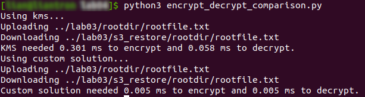

# Practical Worksheet 4

Version: 1.2 Date: 23/08/2018 Author: David Glance

## Learning Objectives

1. IAM policies applied to S3
2.	KMS Key Management System – creating keys and using the key for symmetric encryption
3.	Using AES Encryption for client and server side encryption

## Technologies Covered

Ubuntu
AWS
AWS KMS
AES Encryption
Python/Boto scripts
VirtualBox

Note: Do this from your VirtualBox VM – if you do it from any other platform (Windows, Mac – you will need to resolve any potential issues yourself)

## Background

The aim of this lab is to write a program that will:

1. Apply a policy to your bucket to allow only you as a user to access it
2. Create a key in KMS and use it to encrypt files on the client before uploading to S3 and decrypt them after downloading from S3
3. Implement AES using python and test the difference in performance between the KMS solution and the local one.

## [Step 1] Apply policy to restrict permissions on bucket

Write an application to apply the following policy to the bucket you created in the last lab
to allow only your username to access the bucket. Make the appropriate
changes (folders, username, etc) to the policy as necessary.

```

{
  "Version": "2012-10-17",
  "Statement": {
   "Sid": "AllowAllS3ActionsInUserFolderForUserOnly",
    "Effect": "DENY",
    "Principal": "*",
    "Action": "s3:*",
    "Resource": "arn:aws:s3:::<your_s3_bucket>/folder1/folder2/*",
    "Condition": {
      "StringNotLike": {
          "aws:username":"<studentnumber>@student.uwa.edu.au"
       }
    }
  }
}


```

> Changed `create_bucket` of `cloudstorage.py` to:

```
def create_bucket(bucket_config: dict):
    try:
        response = s3.create_bucket(Bucket=ROOT_S3_DIR, CreateBucketConfiguration=bucket_config)
    except botocore.exceptions.ClientError as error:
        if error.response['Error']['Code'] == 'BucketAlreadyOwnedByYou':
            response = "Bucket already existed."
        else:
            raise error
    policy = {"Version": "2012-10-17",
              "Statement": {
                  "Sid": "AllowAllS3ActionsInUserFolderForUserOnly",
                  "Effect": "DENY",
                  "Principal": "*",
                  "Action": "s3:*",
                  "Resource": f'arn:aws:s3:::{ROOT_S3_DIR}/*',
                  "Condition": {
                      "StringNotLike": {
                          "aws:username": f'{str(USER_ID)}@student.uwa.edu.au'}}}}
    policy = json.dumps(policy)
    s3.put_bucket_policy(Bucket=ROOT_S3_DIR, Policy=policy)
    print(response)
```

Results into:


You can test it by applying the policy to a single folder and using a username that is not your own. Confirm that you no longer have access to that folder's contents.

> Changed policy to:

```
{"Version": "2012-10-17",
              "Statement": {
                  "Sid": "AllowAllS3ActionsInUserFolderForUserOnly",
                  "Effect": "DENY",
                  "Principal": "*",
                  "Action": "s3:*",
                  "Resource": f'arn:aws:s3:::{ROOT_S3_DIR}//rootdir/subdir/*',
                  "Condition": {
                      "StringNotLike": {
                          "aws:username": "123456789@student.uwa.edu.au"}}}}
```


## [Step 2] AES Encryption using KMS

Write an application to create a KSM key. Choose an appropriate alias for the key (your student
number).

Make your username the
administrator and user. You can achieve this by modifying the following policy with your username and
attaching it to the key.

```
{
  "Version": "2012-10-17",
  "Id": "key-consolepolicy-3",
  "Statement": [
    {
      "Sid": "Enable IAM User Permissions",
      "Effect": "Allow",
      "Principal": {
        "AWS": "arn:aws:iam::032418238795:root"
      },
      "Action": "kms:*",
      "Resource": "*"
    },
    {
      "Sid": "Allow access for Key Administrators",
      "Effect": "Allow",
      "Principal": {
        "AWS": "arn:aws:iam::032418238795:user/<your_username>"
      },
      "Action": [
        "kms:Create*",
        "kms:Describe*",
        "kms:Enable*",
        "kms:List*",
        "kms:Put*",
        "kms:Update*",
        "kms:Revoke*",
        "kms:Disable*",
        "kms:Get*",
        "kms:Delete*",
        "kms:TagResource",
        "kms:UntagResource",
        "kms:ScheduleKeyDeletion",
        "kms:CancelKeyDeletion"
      ],
      "Resource": "*"
    },
    {
      "Sid": "Allow use of the key",
      "Effect": "Allow",
      "Principal": {
        "AWS": "arn:aws:iam::032418238795:user/<your_username>"
      },
      "Action": [
        "kms:Encrypt",
        "kms:Decrypt",
        "kms:ReEncrypt*",
        "kms:GenerateDataKey*",
        "kms:DescribeKey"
      ],
      "Resource": "*"
    },
    {
      "Sid": "Allow attachment of persistent resources",
      "Effect": "Allow",
      "Principal": {
        "AWS": "arn:aws:iam::032418238795:user/<your_username>"
      },
      "Action": [
        "kms:CreateGrant",
        "kms:ListGrants",
        "kms:RevokeGrant"
      ],
      "Resource": "*",
      "Condition": {
        "Bool": {
          "kms:GrantIsForAWSResource": "true"
        }
      }
    }
  ]
}
```

> Created `create_kms_key.py`:

```
import boto3
import credentials as cred
import json

USER_ID = str(cred.STUD_NR)
KEY_POLICY = {
    "Version": "2012-10-17",
    "Id": "key-consolepolicy-3",
    "Statement": [
        {
            "Sid": "Enable IAM User Permissions",
            "Effect": "Allow",
            "Principal": {
                "AWS": "arn:aws:iam::523265914192:root"
            },
            "Action": "kms:*",
            "Resource": "*"
        },
        {
            "Sid": "Allow access for Key Administrators",
            "Effect": "Allow",
            "Principal": {
                "AWS": f'arn:aws:iam::523265914192:user/{USER_ID}@student.uwa.edu.au'
            },
            "Action": [
                "kms:Create*",
                "kms:Describe*",
                "kms:Enable*",
                "kms:List*",
                "kms:Put*",
                "kms:Update*",
                "kms:Revoke*",
                "kms:Disable*",
                "kms:Get*",
                "kms:Delete*",
                "kms:TagResource",
                "kms:UntagResource",
                "kms:ScheduleKeyDeletion",
                "kms:CancelKeyDeletion"
            ],
            "Resource": "*"
        },
        {
            "Sid": "Allow use of the key",
            "Effect": "Allow",
            "Principal": {
                "AWS": f'arn:aws:iam::523265914192:user/{USER_ID}@student.uwa.edu.au'
            },
            "Action": [
                "kms:Encrypt",
                "kms:Decrypt",
                "kms:ReEncrypt*",
                "kms:GenerateDataKey*",
                "kms:DescribeKey"
            ],
            "Resource": "*"
        },
        {
            "Sid": "Allow attachment of persistent resources",
            "Effect": "Allow",
            "Principal": {
                "AWS": f'arn:aws:iam::523265914192:user/{USER_ID}@student.uwa.edu.au'
            },
            "Action": [
                "kms:CreateGrant",
                "kms:ListGrants",
                "kms:RevokeGrant"
            ],
            "Resource": "*",
            "Condition": {
                "Bool": {
                    "kms:GrantIsForAWSResource": "true"
                }
            }
        }
    ]
}

kms = boto3.client('kms')

# parse directory and upload files
def create_key():
    key_policy = json.dumps(KEY_POLICY)
    response = kms.create_key(Policy=key_policy)
    kms.create_alias(AliasName="alias/" + USER_ID, TargetKeyId=response['KeyMetadata']['KeyId'])
    print(response)


if __name__ == '__main__':
    create_key()

```

> Output when executed:


In your CloudStorage application add the ability to encrypt and decrypt the files you find using the KMS Client apis of boto3.

> Changed `cloudstorage.py` to:

```
import json
import os
import boto3
import botocore.exceptions
import stat
import sys
import credentials as cred
import pwd
import time

ROOT_DIR = '.'
ROOT_S3_DIR = str(cred.STUD_NR) + '-cloudstorage'
IGNORED = ['./s3_restore', './__', './dynamodb']
USER_ID = str(cred.STUD_NR)

s3 = boto3.client("s3")
kms = boto3.client('kms')
dynamodb = boto3.client('dynamodb', endpoint_url='http://localhost:8000')

def upload_file(folder_name, file, file_name):
    item_from_db = dynamodb.get_item(TableName="CloudFiles",
                                     Key={'userId': {'S': USER_ID}, 'fileName': {'S': file_name}})
    stats = os.stat(file)
    permissions = stat.filemode(stats.st_mode)
    owner = pwd.getpwuid(stats.st_uid).pw_name
    last_updated = time.strftime('%a, %d %b %Y %H:%M:%S %Z', time.gmtime(stats.st_mtime))
    if 'Item' in item_from_db and last_updated == item_from_db['Item']['lastUpdated']['S']:
        print("File has not been changed since last upload.")
        return
    print("Uploading %s" % file)
    try:
        with open(file, 'r') as file:
            key_alias = "alias/" + USER_ID
            encrypted_content = kms.encrypt(KeyId=key_alias, 
                                            Plaintext=bytes(file.read(), 'utf-8'))['CiphertextBlob']
            print("Decrypted content into %s" % encrypted_content)
            response = s3.put_object(Bucket=ROOT_S3_DIR, Body=encrypted_content, 
                                      Key="/%s%s" % (folder_name, file_name))
            print(response)
            dynamodb.put_item(TableName='CloudFiles',
                              Item={'userId': {'S': USER_ID}, 'fileName': {'S': file_name},
                                    'path': {'S': folder_name}, 'lastUpdated': {'S': last_updated}, 
                                    'owner': {'S': owner}, 'permissions': {'S': permissions}})
    except Exception as error:
        print("Error: " + str(error))


def create_bucket(bucket_config: dict):
    try:
        response = s3.create_bucket(Bucket=ROOT_S3_DIR, CreateBucketConfiguration=bucket_config)
    except botocore.exceptions.ClientError as error:
        if error.response['Error']['Code'] == 'BucketAlreadyOwnedByYou':
            response = "Bucket already existed."
        else:
            raise error
    policy = {"Version": "2012-10-17",
              "Statement": {
                  "Sid": "AllowAllS3ActionsInUserFolderForUserOnly",
                  "Effect": "DENY",
                  "Principal": "*",
                  "Action": "s3:*",
                  "Resource": f'arn:aws:s3:::{ROOT_S3_DIR}/*',
                  "Condition": {
                      "StringNotLike": {
                          "aws:username": f'{str(USER_ID)}@student.uwa.edu.au'}}}}
    policy = json.dumps(policy)
    s3.put_bucket_policy(Bucket=ROOT_S3_DIR, Policy=policy)
    print(response)


# parse directory and upload files
def upload_files():
    for dir_name, subdir_list, file_list in os.walk(ROOT_DIR, topdown=True):
        if dir_name != ROOT_DIR and not any(list(map(dir_name.startswith, IGNORED))):
            for fname in file_list:
                upload_file("%s/" % dir_name[2:], "%s/%s" % (dir_name, fname), fname)

    print("done")


if __name__ == '__main__':
    bucket_config = {'LocationConstraint': 'ap-southeast-2'}
    if '-i' in sys.argv or '--initialise=True' in sys.argv:
        create_bucket(bucket_config)
        upload_files()

```

> Changed `restorefromcloud.py` to:

```
import os
import boto3
import credentials as cred
import pwd
import stat
import sys
import credentials as cred

ROOT_DIR = '.'
ROOT_S3_DIR = str(cred.STUD_NR) + '-cloudstorage'
USER_ID = str(cred.STUD_NR)

kms = boto3.client('kms')


def create_permission_logic(permissions: str):
    p_arg = False
    if permissions[0] == 'r':
        p_arg = p_arg | stat.S_IRUSR
    if permissions[1] == 'w':
        p_arg = p_arg | stat.S_IWUSR
    if permissions[2] == 'x':
        p_arg = p_arg | stat.S_IXUSR
    if permissions[3] == 'r':
        p_arg = p_arg | stat.S_IRGRP
    if permissions[4] == 'w':
        p_arg = p_arg | stat.S_IWGRP
    if permissions[5] == 'x':
        p_arg = p_arg | stat.S_IXGRP
    if permissions[6] == 'r':
        p_arg = p_arg | stat.S_IROTH
    if permissions[7] == 'w':
        p_arg = p_arg | stat.S_IWOTH
    if permissions[8] == 'x':
        p_arg = p_arg | stat.S_IXOTH
    return p_arg


def restore_file(file_name: str, owner: str, permissions: str):
    print("Downloading %s" % file_name)
    filecontent = b''
    try:
        key_alias = "alias/" + USER_ID
        response = s3.get_object(Bucket=ROOT_S3_DIR, Key=file_name)
        decrypted_content = kms.decrypt(CiphertextBlob=response['Body'].read(), 
                                        KeyId=key_alias)['Plaintext']
        filecontent = decrypted_content
    except Exception as error:
        print("Error: " + str(error))

    if not owner == "":
        # Checking uid here to abort if not fitting user exists
        # before anything is actually pulled out of bucket
        uid = pwd.getpwnam(owner).pw_uid
    if not permissions == "":
        p_arg = create_permission_logic(permissions)

    path = './s3_restore' + '/'.join(file_name.split('/')[:-1])

    if not os.path.exists(path):
        os.makedirs(path)
    with open(str("./s3_restore" + file_name), 'w') as file:
        file.write(bytes.decode(filecontent))

    if not owner == "":
        os.chown(str("./s3_restore" + file_name), uid, -1)
    if not permissions == "":
        os.chmod(str("./s3_restore" + file_name), p_arg)


# parse directory and upload files
def restore_files(owner: str, permissions: str):
    objects_of_bucket = s3.list_objects_v2(Bucket=ROOT_S3_DIR)
    if 'Contents' in objects_of_bucket:
        for content in objects_of_bucket['Contents']:
            restore_file(file_name=content['Key'], owner=owner, permissions=permissions)
    print("done")


if __name__ == '__main__':
    s3 = boto3.client("s3")
    bucket_config = {'LocationConstraint': 'ap-southeast-2'}
    owner = ""
    permissions = ""
    if '--owner' in sys.argv:
        i = sys.argv.index('--owner') + 1
        if len(sys.argv) > i:
            owner = sys.argv[i]
        else:
            raise Exception("--owner needs a parameter.")
    if '--permissions' in sys.argv:
        i = sys.argv.index('--permissions') + 1
        if len(sys.argv) > i:
            permissions = sys.argv[i]
        else:
            raise Exception("--permissions needs a parameter.")
    restore_files(owner=owner, permissions=permissions)

```

> When executed:


**Optional**

Encrypt only operates on 4 KB of data and so if you were to use this as a means of encrypting larger files, you would have to encrypt the file in chunks and reverse the process for decryption.

## [Step 3] AES Encryption using local python library pycryptodome

Create another version of your CloudStorage program that uses the python library pycryptodome to encrypt and decrypt your files

You can use the example code for doing this from https://github.com/dglance/cits5503/blob/master/Labs/src/fileencrypt.py

What is the performance difference between using KMS and using the custom solution?

> Created `encrypt_decrypt_comparison.py`:

```
from time import time

import boto3
import credentials as cred
import hashlib
import os
import struct

from Crypto import Random
from Crypto.Cipher import AES

BLOCK_SIZE = 16
CHUNK_SIZE = 64 * 1024
USER_ID = str(cred.STUD_NR)
ROOT_DIR = '.'
ROOT_S3_DIR = str(cred.STUD_NR) + '-cloudstorage'

s3 = boto3.client("s3")
kms = boto3.client('kms')

def encrypt_file_custom(password: str, in_filename: str):

    key = hashlib.sha256(password.encode("utf-8")).digest()

    iv = Random.new().read(AES.block_size)
    encryptor = AES.new(key, AES.MODE_CBC, iv)
    filesize = os.path.getsize(in_filename)

    encrypted_content = b''
    with open(in_filename, 'rb') as infile:
        encrypted_content += struct.pack('<Q', filesize)
        encrypted_content += iv

        while True:
            chunk = infile.read(CHUNK_SIZE)
            if len(chunk) == 0:
                break
            elif len(chunk) % 16 != 0:
                chunk += ' '.encode("utf-8") * (16 - len(chunk) % 16)

            encrypted_content += encryptor.encrypt(chunk)

    return encrypted_content


def decrypt_file_custom(password: str, in_filename: str):

    key = hashlib.sha256(password.encode("utf-8")).digest()

    with open(in_filename, 'rb') as infile:
        origsize = struct.unpack('<Q', infile.read(struct.calcsize('Q')))[0]
        iv = infile.read(16)
        decryptor = AES.new(key, AES.MODE_CBC, iv)

        with open(in_filename, 'wb') as outfile:
            while True:
                chunk = infile.read(CHUNK_SIZE)
                if len(chunk) == 0:
                    break
                write = decryptor.decrypt(chunk)
                outfile.write(write)

            #outfile.truncate(origsize)


def encrypt_file_kms(key_alias: str, in_filename: str):
    with open(in_filename, 'rb') as infile:
        content = infile.read(CHUNK_SIZE)
    encrypted_content = kms.encrypt(KeyId=key_alias, Plaintext=content)['CiphertextBlob']
    return encrypted_content


def decrypt_file_kms(key_alias: str, filename: str):
    with open(filename, 'rb') as outfile:
        filecontent = outfile.read()
    decrypted_content = kms.decrypt(CiphertextBlob=filecontent, KeyId=key_alias)['Plaintext']
    with open(filename, 'w') as outfile:
        outfile.write(bytes.decode(decrypted_content))


def upload_file(folder_name: str, file_path: str, file_name: str, key: str, kms: bool):
    print("Uploading %s" % file_path)
    start = time()
    if kms:
        encrypted_content = encrypt_file_kms(key_alias=key, in_filename=file_path)
    else:
        encrypted_content = encrypt_file_custom(password=key, in_filename=file_path)
    end = time()
    response = s3.put_object(Bucket=ROOT_S3_DIR, Body=encrypted_content, 
                                Key="/%s%s" % (folder_name, file_name))
    return end - start

def download_file(file_path: str, path: str, bucket_key: str, key: str, kms: bool):
    print("Downloading %s" % file_path)
    response = s3.get_object(Bucket=ROOT_S3_DIR, Key=bucket_key)
    filecontent = response['Body'].read()
    if not os.path.exists(path):
        os.makedirs(path)
    with open(file_path, 'wb') as file:
        file.write(filecontent)
    start = time()
    if kms:
        decrypt_file_kms(key_alias=key, filename=file_path)
    else:
        decrypt_file_custom(password=key, in_filename=file_path)
    end = time()
    return end - start


if __name__ == '__main__':
    key_alias = "alias/" + USER_ID
    password = 'password'
    folder_name = "/rootdir/"
    file_path = "../lab03/rootdir/rootfile.txt"
    file_name = "rootfile.txt"
    download_file_path = "../lab03/s3_restore/rootdir/rootfile.txt"
    download_path = "../lab03/s3_restore/rootdir/"
    print("Using kms...")
    encrypt_kms = upload_file(folder_name=folder_name, file_path=file_path,
                                file_name=file_name, key=key_alias, kms=True)
    decrypt_kms = download_file(file_path=download_file_path, path=download_path,
                                bucket_key=folder_name + "rootfile.txt", key=key_alias, kms=True)
    print('KMS needed %0.3f ms to encrypt and %0.3f ms to decrypt.' % (encrypt_kms, decrypt_kms))
    print("Using custom solution...")
    encrypt_custom = upload_file(folder_name=folder_name, file_path=file_path, 
                                file_name=file_name, key=password, kms=False)
    decrypt_custom = download_file(file_path=download_file_path, path=download_path,
                                bucket_key=folder_name + "rootfile.txt", key=password, kms=False)
    print('Custom solution needed %0.3f ms to encrypt and %0.3f ms to decrypt.'
            % (encrypt_custom, decrypt_custom))
```

> When executed:



The custom solution is faster than AWS.


Lab Assessment:

This semester all labs will be assessed as "Lab notes". You should follow all steps in each lab and include your own comments. In addition, include screenshots showing the output for every commandline instruction that you execute in the terminal and any other relevant screenshots that demonstrate you followed the steps from the corresponding lab. Please also include any linux or python script that you create and the corresponding output you get when executed.
Please submit a single PDF file. The formatting is up to you but a well organised structure of your notes is appreciated.


