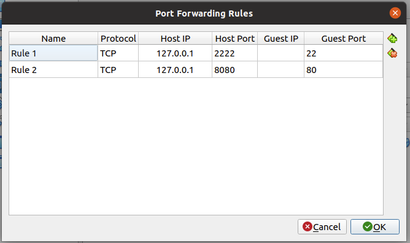
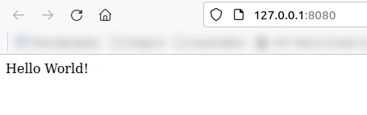
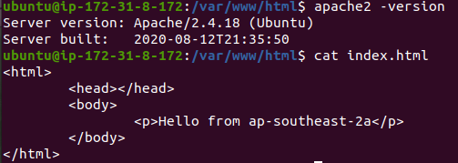
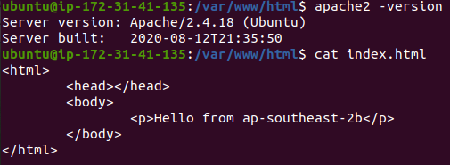

# Practical Worksheet 5
Version: 1.1 Date: 28/08/2018 Author: David Glance

Date: 10/09/2022 Author: Anwarul Patwary 

## Learning Objectives

1.	Networking and NAT
2.	Setting up an Application Load Balancer

Technologies Covered

Ubuntu
AWS
AWS ELB
Networking
NAT
Python/Boto scripts
VirtualBox

Note: Do this from your VirtualBox VM – if you do it from any other platform (Windows, Mac – you will need to resolve any potential issues yourself)

## Background

The aim of this lab is to write a program that will:

[1] Understand how to configure different network arrangements to gain and control access to computers and other networked resources
[2] Understand IP addressing and CIDR and the meaning of TCP and UDP ports

## Networking

### [Step 1] Configure inbound IP on VirtualBox VM

This can be done in a number of ways, but we are going to use NAT port mapping. When a VM is created in VirtualBox, it defaults to creating a single NAT interface

[1] The VM does not have to be stopped for this but it isn’t a bad idea to make changes when it is stopped.

[2] In the VirtualBox Manager, select the VM you want to configure, then click Settings (Golden Gear Cog) and Network. Adapter 1 should be configured as NAT. Click on Advanced and then Port Forwarding. Set up 2 rules:
   [a] Use the localhost host IP 127.0.0.1 and host port 2222 and map that to Guest Port 22
   [b] Add a similar rule mapping Host Port 8080 to Guest Port 80



[3] Testing! You can test the NAT’d ports by running your docker app and seeing if you can access it from your computer – the url will be http://127.0.0.1:8080



Enable ssh to the VM by installing **sshd** as follows:

```
sudo apt install tasksel
sudo tasksel install openssh-server
```


start the ssh service by:

```
sudo service ssh start
```

you can stop it using:

```
 sudo service ssh stop
 ```

To ssh to the VM, open a terminal on your PC (or use Putty) and ssh as

```
ssh -p 2222 <usermame>@127.0.0.1
```


You should be prompted for your password

### [Step 2] Setting up an Application Load Balancer

The aim of this part of the lab is to create an application load
balancer and load balance requests to 2 EC2 instances. As there is a
restriction of only 20 load balancers per region, we are going to
relax the requirement to create instances and the ELB in the
ap-southeast-2 region.

Before running the application to create a load balancer and
instances, check how many are running in a particular region. Select a
region that has capacity.

**Remember** Delete the load balancer immediately after completing the
lab.

### USE YOUR STUDENT NUMBER TO IDENTIFY ALL RESOURCES

Objective: Write an application to create 2 EC2 instances in two availability zones, create an application load balancer and load balance HTTP requests to the 2 instances.

You will need to do some manual intervention to get Apache 2 installed and the index.html file edited. Do this after you have created the instances and ALB. In a future lab you will learn how this could be done through a program as well.

[1] Write a Boto3 application to create 2 EC2 instances in two
different availability zones of a specific region. Name the instances
<student number>_zone

Note: You will need to use v2 of the ELB interface:

```
client = boto3.client('elbv2')
```

[2] Create the Application Load Balancer.

The steps involved in this are:

[a] Create the load balancer and specify the two region subnets and a
security group

[b] Create a target group using the same VPC that you used to create
the instances - note the ARN that is output

[c] Register targets in the target group

[d] Create a listener with a default rule Protocol: HTTP and Port 80
forwarding on to the target group


> Created `app_load_balancer.py`:

```
import boto3
import credentials as cred
import time


def create_instance(ec2, groupname: str, availablity_zone: str, stud_nr: str):
    name = stud_nr + "_" + availablity_zone
    instance = ec2.run_instances(ImageId="ami-d38a4ab1", SecurityGroupIds=[groupname], 
                                 MaxCount=1, MinCount=1,
                                 InstanceType='t2.micro', KeyName=keyname,
                                 Placement={'AvailabilityZone': availablity_zone},
                                 TagSpecifications=[{'ResourceType': 'instance',
                                                     'Tags': [{'Key': 'Name', 'Value': name}, ]}, ], )
    return instance['Instances'][0]['InstanceId']


def wait_until_instances_are_running(instance_ids):
    ec2_r = boto3.resource('ec2')
    for id in instance_ids:
        ec2_r.Instance(id).wait_until_running()


def security_group_id(ec2, group_name: str):
    response = ec2.describe_security_groups(Filters=[{'Name': 'group-name', 'Values': [group_name]}])
    return response['SecurityGroups'][0]['GroupId']


def create_load_balancer(elbv2):
    lb_name = str(student_nr) + "-lb"
    group_id = security_group_id(ec2, groupname)
    subnets = ec2.describe_subnets(Filters=[{'Name': 'availability-zone', 
                                             'Values': [zone_a, zone_b]}])['Subnets']
    subnet_ids = []
    for s in subnets:
        subnet_ids.append(s['SubnetId'])
    balancer = elbv2.create_load_balancer(Name=lb_name, Subnets=subnet_ids, 
                                          SecurityGroups=[group_id])['LoadBalancers'][0]
    balancer_arn = balancer['LoadBalancerArn']
    balancer_dns = balancer['DNSName']
    return balancer_arn, balancer_dns


def create_listener(ec2, elbv2):
    vpc_id = ec2.describe_vpcs()['Vpcs'][0]['VpcId']
    target_group_name = str(student_nr) + "-tg"
    target_arn = elbv2.create_target_group(Name=target_group_name, Protocol='HTTP',
                                           Port=80, VpcId=vpc_id)['TargetGroups'][0]['TargetGroupArn']
    elbv2.register_targets(TargetGroupArn=target_arn, 
                           Targets=[{'Id': instance_a_id}, {'Id': instance_b_id}])
    elbv2.create_listener(LoadBalancerArn=balancer_arn, Protocol='HTTP', Port=80,
                          DefaultActions=[{'Type': 'forward', 'TargetGroupArn': target_arn}])


def get_public_ip(ec2, instance_ids):
    inst_descriptions = ec2.describe_instances(InstanceIds=instance_ids)['Reservations']
    ips = []
    for i in inst_descriptions:
        ips.append(i['Instances'][0]['PublicIpAddress'])
    return ips

if __name__ == '__main__':
    student_nr = cred.STUD_NR
    ec2 = boto3.client('ec2')
    groupname = str(student_nr) + "-sg"
    keyname = str(student_nr) + "-key"
    zone_a = "ap-southeast-2a"
    zone_b = "ap-southeast-2b"

    instance_a_id = create_instance(ec2, groupname, zone_a, str(student_nr))
    instance_b_id = create_instance(ec2, groupname, zone_b, str(student_nr))

    wait_until_instances_are_running([instance_a_id, instance_b_id])
    ips = get_public_ip(ec2, [instance_a_id, instance_b_id])
    print('Instances with following public ips have been created: ' + str(ips))

    elbv2 = boto3.client('elbv2')
    balancer_arn, balancer_dns = create_load_balancer(elbv2)
    create_listener(ec2, elbv2)
    print('Access via ' + balancer_dns)


```

> Output:


Try and access the EC2 instance using the public IP address of the load balancer in a browser. The load balancer will not be working at this point because Apache 2 is not installed. Check this and then:

On each instance, install apache2

```
sudo apt install apache2
```

Edit the /var/www/html/index.html file to report the instance name

> Changed instances:





Now Verify that the load balancer is working. You should be able to
access both of the EC2 instances by refreshing the page.


*IMPORTANT* When finished. Delete the Load balancer, target group,
listener and EC2 instances.

Lab Assessment:

This semester all labs will be assessed as "Lab notes". You should follow all steps in each lab and include your own comments. In addition, include screenshots showing the output for every commandline instruction that you execute in the terminal and any other relevant screenshots that demonstrate you followed the steps from the corresponding lab. Please also include any linux or python script that you create and the corresponding output you get when executed.
Please submit a single PDF file. The formatting is up to you but a well organised structure of your notes is appreciated.
