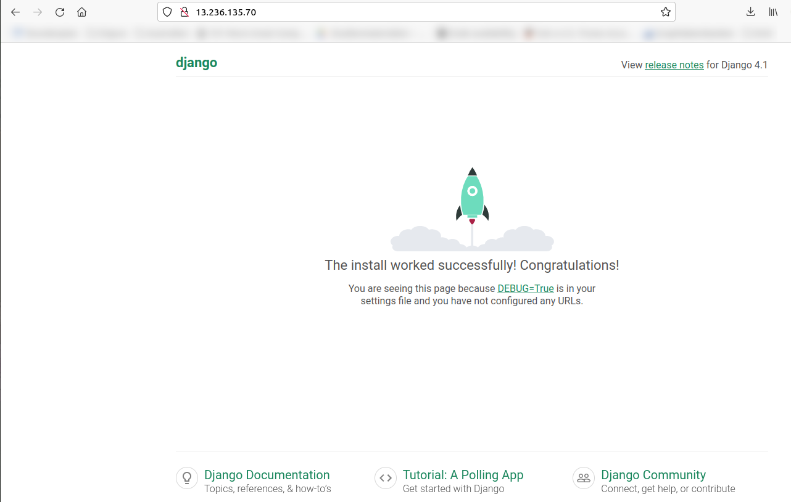
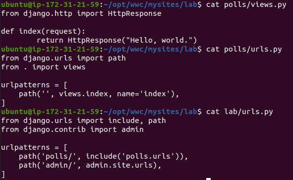
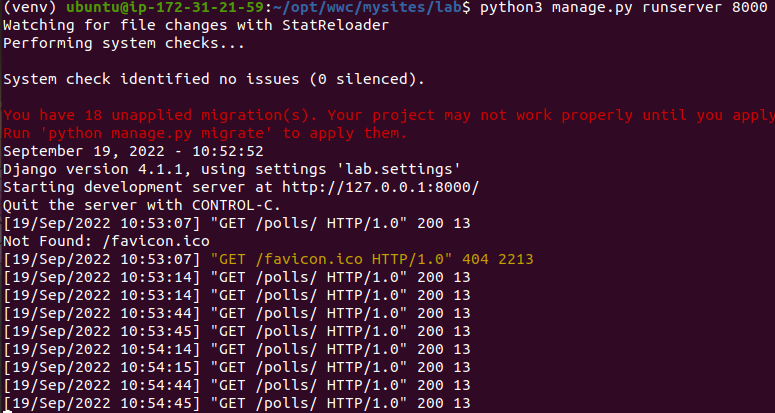

# Practical Worksheet 6

Version: 1.0 Date: 12/04/2018 Author: David Glance

## Learning Objectives

1.	Create a web app using Django
2.	Implement nginx and load balance requests to it
3.	Retrieve data from DynamoDB to display in the app

## Technologies Covered

Ubuntu
AWS
AWS ELB
RDS
Python/Boto scripts

Note: Do this from your VirtualBox VM – if you do it from any other platform (Windows, Mac – you will need to resolve any potential issues yourself)

## Background

The aim of this lab is to write a program that will:

[1] Understand the basis for a web architecture that incorporates scalability and security using ELB
[2] Familiarise yourself with the basics of programming using Django

## EC2 instance

### [Step 1] Create an EC2 instance

[1] Create an EC2 micro instance using Ubuntu and SSH into it.

```
sudo apt-get update
sudo apt-get upgrade
sudo apt-get install python3-venv
```


It is easier now if you change the bash to operate as sudo

```
sudo bash
```

[2] Create a directory with a path /opt/wwc/mysites and cd into that.  Set up a virtual environment as you did in the first lab:

```
python3 -m venv venv
```


Activate your virtual environment and then:

```
pip install django

django-admin startproject lab
cd lab
python3 manage.py startapp polls
```


Stop and look at the files that have been created – the project files are to do with the running of the application. We will deal with the files as we go through.


### [Step 2] Install and configure nginx

[1] install nginx

```
apt install nginx
```

edit /etc/nginx/sites-enabled/default and replace the contents of the file with

```
server {
  listen 80 default_server;
  listen [::]:80 default_server;

  location / {
    proxy_set_header X-Forwarded-Host $host;
    proxy_set_header X-Real-IP $remote_addr;

    proxy_pass http://127.0.0.1:8000;
  }
}
```


Once you have done this you can restart nginx

```
service nginx restart
```

in your app directory: /opt/wwc/mysites/lab you can run

```
python3 manage.py runserver 8000
```


If you go to a browser now and use the ip address of your ec2 instance, you should see:



### [Step 3] Changing the code

[1] Following the steps outlined in the lecture, edit the following files

edit polls/views.py

```
from django.http import HttpResponse

def index(request):
    return HttpResponse("Hello, world.")
```

edit polls/urls.py

```
from django.urls import path
from . import views

urlpatterns = [
    path('', views.index, name='index'),
]
```

edit lab/urls.py

```
from django.urls import include, path
from django.contrib import admin

urlpatterns = [
    path('polls/', include('polls.urls')),
    path('admin/', admin.site.urls),
]
```



now run

```
python3 manage.py runserver 8000
```

and check that you get Hello, world. when you type the url http://\<ip address>/polls/


NOTE remember to put the /polls/ on the end and you may need to restart nginx if it didn't work earlier.

### [Step 4] Adding the load balancer

[1] Create an application load balancer as you did last week

[2] Choose the security group – it must allow HTTP


[3] For the target group, in the health check, specify /polls/ for the path


[4] Add your instance as a registered target


Once you have created the ELB, you should see the health check fetch the /polls/ page every 30 seconds



You can now access the site using the url http://\<load balancer dns name>/polls/


### [Extension] Web interface for CloudStorage application

You will need to create a table and update the data in it as you did in the DynamoDB lab. You will need to create a local version of DynamoDB as in the previous lab as well as copy across your AWS credentials and previous scripts (hint. check out the scp command here).

In views.py, add boto3 (remember to pip install) code to scan the DynamoDB table you created for your CloudStorage command line application. Display the results in the calling page.

In Django, you can use templates to properly format a web page using supplied variables – you can do that to make the table look nice. To use a template, you need to create a templates directory under polls and then add to the TEMPLATES section of lab/settings.py

```
TEMPLATES = [
    {
        'BACKEND': 'django.template.backends.django.DjangoTemplates',
        'DIRS': [
            'polls/templates/'
        ],
```

In the templates directory, add a file files.html with the following contents:

```
<html>
<head>
    <title>Files</title>
</head>
<body>
    <h1>Files </h1>


    <ul>
        
          <li>{{ item.fileName }}</li>
	
    </ul>

</body>
</html>
```


Finally in views.py, you can pass variables from your DynamoDB call and render the template in the following way:

```
from django.shortcuts import render
from django.template import loader
from django.http import HttpResponse
import boto3
import json
from boto3.dynamodb.conditions import Key, Attr
from botocore.exceptions import ClientError

def index(request):
    template = loader.get_template('files.html')

    dynamodb = boto3.resource('dynamodb', region_name='ap-southeast-2',
                              aws_access_key_id='Your Access Key',
                              aws_secret_access_key='Your Secret')

    table = dynamodb.Table("UserFiles")

    items = []
    try:
        response = table.scan()

    except ClientError as e:
        print(e.response['Error']['Message'])
    else:    
        context = {'items': response['Items'] }

        return HttpResponse(template.render(context, request))
```


You can add variables to the template and more formatting to display the information correctly.

Lab Assessment:

This semester all labs will be assessed as "Lab notes". You should follow all steps in each lab and include your own comments. In addition, include screenshots showing the output for every commandline instruction that you execute in the terminal and any other relevant screenshots that demonstrate you followed the steps from the corresponding lab. Please also include any linux or python script that you create and the corresponding output you get when executed.
Please submit a single PDF file. The formatting is up to you but a well organised structure of your notes is appreciated.


