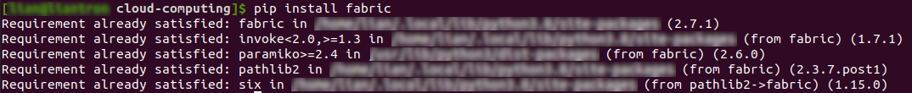
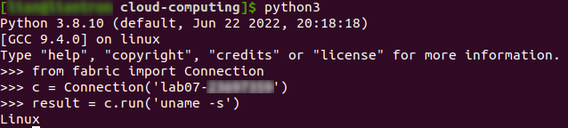

# Practical Worksheet 7

Version: 1.2 Date: 15/9/2018 Author: David Glance
Update: 25/9/2022 Author: Anwarul Patwary
## Learning Objectives

1.	Install and configure Fabric
2.	Deploy a server with nginx installed and configured by Fabric
3. 	Deploy Django code using Fabric

## Technologies Covered

Ubuntu
AWS
Python
Fabric

## Background

The aim of this lab is to write a program that will:
 
[1] Background and basics to Fabric
[2] How to automatically deploy a server using Fabric

### [Step 1] Create an EC2 instance

Use your existing code to create an EC2 instance that you will test
your Fabric-based installation on.


### [Step 2] Install and configure Fabric on your VM

NOTE do this on your VirtualBox VM

The easiest way to install fabric is to:

```
pip install fabric
```



You will need to create a config file in ~/.ssh with the contents:

```
Host <ec2instance>
	Hostname <EC2 instance public DNS>
	User ubuntu
	UserKnownHostsFile /dev/null
	StrictHostKeyChecking no
	PasswordAuthentication no
	IdentityFile <path to your private key>
```


	
You can test fabric from the command line:

Remember to replace <ec2instance> with your EC2 name you used in the
configuration - use your student number to identify resources.

```
python
>>> from fabric import Connection
>>> c = Connection(‘<ec2instance>’)
>>> result = c.run(‘uname -s’)
Linux
>>>
```



### [Step 3] Write a python script to automate the installation of nginx

Write a python script using fabric to set up and configure nginx as
you did for the Django app last week

This will consiste of doing the same commands you would do manually to
configure nginx but using the commands:

sudo("commands go here separated by ;")

and/or

run("Commands go here separated by ;")

> Created `nginx_installer.py`:

```
from fabric import Connection
import credentials as cred
import os


if __name__ == '__main__':
    stud_nr = str(cred.STUD_NR)
    ssh_con = 'lab07-' + stud_nr
    c = Connection(ssh_con)
    c.sudo('apt update -y')
    c.sudo('apt upgrade -y')
    c.sudo('apt install nginx -y')
    os.system('scp ./default ' + ssh_con + ':/home/ubuntu')
    c.sudo('mv /home/ubuntu/default /etc/nginx/sites-enabled/')
    c.sudo('service nginx restart')
```

> And, in the same directory, the file `default`:

```
server {
  listen 80 default_server;
  listen [::]:80 default_server;

  location / {
    proxy_set_header X-Forwarded-Host $host;
    proxy_set_header X-Real-IP $remote_addr;

    proxy_pass http://127.0.0.1:8000;
  }
}
```


## [Step 4] Update the python script to install your Django app

You will copy the files from your local directory to the new EC2 instance. You may find this easier if you create a tar/zip file first of the code and then untar/unzip on the EC2 machine.

Add the necessary commands to configure the virtual environment and
clone your Django app from your local directory - this is basically taking the
instructions you used in that lab and converting them to Fabric commands.

The final command should be the command to run the server - if you add
an '&' at the end it will run the process in the background. Note -
you would normally use Gunicorn to do this not manage.py runserver but
we are keeping it simple.

The documentation for Fabric is here: http://docs.fabfile.org/en/2.0/

> Changed `nginx_installer.py`:

```
from fabric import Connection
import credentials as cred
import os


def install_nginx(c, stud_nr):
    c.sudo('apt install nginx -y')
    os.system(f'scp ./default lab07-{stud_nr}:/home/ubuntu')
    c.sudo('mv /home/ubuntu/default /etc/nginx/sites-enabled/')
    c.sudo('service nginx restart')


def install_django(c):
    c.sudo('mkdir -p ~/opt/wwc/mysites')
    c.sudo('apt install python3-pip -y')
    c.run('pip3 install django')
    c.run('django-admin startproject lab')
    c.run('cd ./lab && python3 manage.py startapp polls')
    c.sudo('mv ./lab ~/opt/wwc/mysites')


if __name__ == '__main__':
    stud_nr = str(cred.STUD_NR)
    c = Connection(f'lab07-{stud_nr}')
    c.sudo('apt update -y')
    c.sudo('apt upgrade -y')
    install_django(c)
    install_nginx(c, stud_nr)
    c.sudo('python3 ~/opt/wwc/mysites/lab/manage.py runserver 8000 &')

```

## [Step 5] Terminate the instance you created. Otherwise, you might lose the mark. 


Lab Assessment:
	
This semester all labs will be assessed as "Lab notes". You should follow all steps in each lab and include your own comments. In addition, include screenshots showing the output for every commandline instruction that you execute in the terminal and any other relevant screenshots that demonstrate you followed the steps from the corresponding lab. Please also include any linux or python script that you create and the corresponding output you get when executed.
Please submit a single PDF file. The formatting is up to you but a well organised structure of your notes is appreciated.


