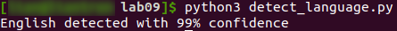
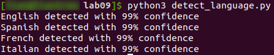
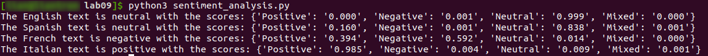
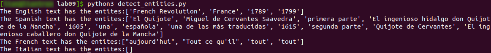
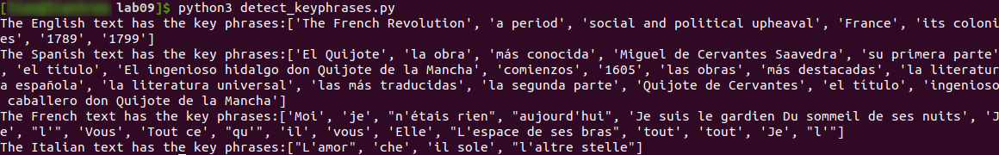
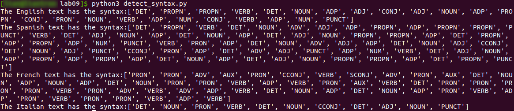
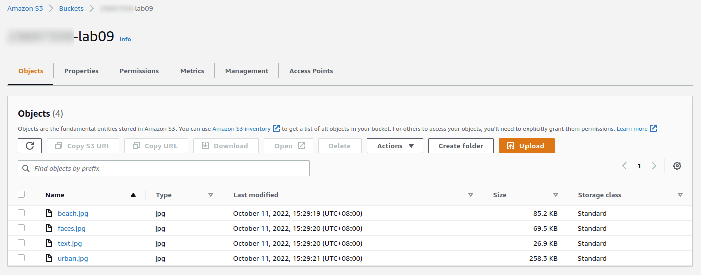
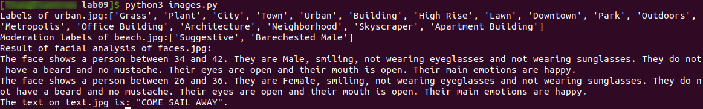

# Practical Worksheet 9

Version: 1.0 Date: 4/10/2021 Author: Camilo Pestana

## Learning Objectives

1. Learn more about AI and Machine Learning services available on AWS.
2. Use boto3 to get hands-on experience on using useful AI services in AWS for Natural Language Processing (NLP)/ Natural Language Understanding (NLU) and Computer Vision.

## Technologies Covered
- Ubuntu
- AWS Comprehend
- AWS Rekognition
- boto3
- Python

## Background

The aim of this lab is to write a serie of scripts that will test the main features of AWS Comprehend and AWS Rekognition.

## AWS Comprehend

AWS Comprehend offerts different services to analyse text using machine learning. With Comprehend API, you will be able to perform common NLP tasks such as sentiment analysis, or simply detecting the language from the text.

"Amazon Comprehend can discover the meaning and relationships in text from customer support incidents, product reviews, social media feeds, news articles, documents, and other sources. For example, you can identify the feature that’s most often mentioned when customers are happy or unhappy about your product."
[Source](https://ap-southeast-2.console.aws.amazon.com/comprehend/v2/home?region=ap-southeast-2#welcome)

For example, to detect the language used in a given text using boto3 you can use the following code:
```python
import boto3
client = boto3.client('comprehend')

# Detect Entities
response = client.detect_dominant_language(
    Text="The French Revolution was a period of social and political upheaval in France and its colonies beginning in 1789 and ending in 1799.",
)

print(response['Languages'])
```

By executing that code we will get something like this:
```
Output:
[{'LanguageCode': 'en', 'Score': 0.9961233139038086}]
```
This means that the detected language is 'en' (English) and has a confidence in the prediction greater than 0.99. 

*Note*: Remember that often in machine learning the confidence score is expressed as a value in the range [0,1] being zero the lack of certainty and 1 being totally certain of the prediction.

### [Step 1] Detecting Languages from text

#### [Step 1.1] Modify code
Based on the previous code, create a script that can recognized different languages. However, instead of language code (e.g., 'en' for English or 'it' for italian) it should be return the message "<predicted_language> detected with xx% confidence" where <predicted_language> correspond to the name of the language in English and the confidence (x.xx) is given as a percentage. For the previous example the result should look like this:
```
Output:
English detected with 99% confidence
```

> Created `detect_language.py`

```python
import boto3
from iso639 import languages

client = boto3.client('comprehend')

# Detect Entities
response = client.detect_dominant_language(
    Text="The French Revolution was a period of social and political upheaval in France and its colonies beginning in 1789 and ending in 1799.",
)

language_name = languages.get(alpha2=response['Languages'][0]['LanguageCode']).name
language_store = int(response['Languages'][0]['Score'] * 100)
print(language_name + " detected with " + str(language_store) + "% confidence")
```



#### [Step 1.2] Test your code with other languages

Test your code using the following texts in different languages:

**Spanish:**
"El Quijote es la obra más conocida de Miguel de Cervantes Saavedra. Publicada su primera parte con el título de El ingenioso hidalgo don Quijote de la Mancha a comienzos de 1605, es una de las obras más destacadas de la literatura española y la literatura universal, y una de las más traducidas. En 1615 aparecería la segunda parte del Quijote de Cervantes con el título de El ingenioso caballero don Quijote de la Mancha."

**French:**
"Moi je n'étais rien Et voilà qu'aujourd'hui Je suis le gardien Du sommeil de ses nuits Je l'aime à mourir Vous pouvez détruire Tout ce qu'il vous plaira Elle n'a qu'à ouvrir L'espace de ses bras Pour tout reconstruire Pour tout reconstruire Je l'aime à mourir"
[From the Song: "Je l'Aime a Mourir" - Francis Cabrel ]

**Italian:**
"L'amor che move il sole e l'altre stelle."
[Quote from "Divine Comedy" - Dante Alighieri]

```python
import boto3
from iso639 import languages

def create_answer(response):
    language_name = languages.get(alpha2=response['Languages'][0]['LanguageCode']).name
    language_store = int(response['Languages'][0]['Score'] * 100)
    return language_name + " detected with " + str(language_store) + "% confidence"

client = boto3.client('comprehend')

eng = "The French Revolution was a period of social and political upheaval in France and its colonies beginning in 1789 and ending in 1799."
span = "El Quijote es la obra más conocida de Miguel de Cervantes Saavedra. Publicada su primera parte con el título de El ingenioso hidalgo don Quijote de la Mancha a comienzos de 1605, es una de las obras más destacadas de la literatura española y la literatura universal, y una de las más traducidas. En 1615 aparecería la segunda parte del Quijote de Cervantes con el título de El ingenioso caballero don Quijote de la Mancha."
fren = "Moi je n'étais rien Et voilà qu'aujourd'hui Je suis le gardien Du sommeil de ses nuits Je l'aime à mourir Vous pouvez détruire Tout ce qu'il vous plaira Elle n'a qu'à ouvrir L'espace de ses bras Pour tout reconstruire Pour tout reconstruire Je l'aime à mourir"
itan = "L'amor che move il sole e l'altre stelle."

response_eng = client.detect_dominant_language(Text=eng,)
response_span = client.detect_dominant_language(Text=span,)
response_fren = client.detect_dominant_language(Text=fren,)
response_itan = client.detect_dominant_language(Text=itan,)

print(create_answer(response_eng))
print(create_answer(response_span))
print(create_answer(response_fren))
print(create_answer(response_itan))
```



#### [Step 2] Sentiment Analysis

Sentiment analysis (or opinion mining) uses NLP to determine whether data is positive, negative or neutral. Sentiment analysis is often performed on textual data to help businesses monitor brand and product sentiment in customer feedback, and understand customer needs.

**Task:** Use boto3 and AWS comprehend to create a python script for sentiment analysis. Use the previous 3 texts to test the script.

> Created `sentiment_analysis.py`:

```python
import boto3
from iso639 import languages

def sentiment_analysis(text):
    language_code = client.detect_dominant_language(Text=text, )['Languages'][0]['LanguageCode']
    analysis = client.detect_sentiment(Text=text, LanguageCode=language_code)
    sentiment = str.lower(analysis['Sentiment'])
    sentiment_scores = analysis['SentimentScore']
    sentiment_scores = {k: format(v, '.3f') for k, v in sentiment_scores.items()}
    language_name = languages.get(alpha2=language_code).name
    return "The " + language_name + " text is " + sentiment + 
            " with the scores: " + str(sentiment_scores)

client = boto3.client('comprehend')

eng = "The French Revolution was a period of social and political upheaval in France and its colonies beginning in 1789 and ending in 1799."
span = "El Quijote es la obra más conocida de Miguel de Cervantes Saavedra. Publicada su primera parte con el título de El ingenioso hidalgo don Quijote de la Mancha a comienzos de 1605, es una de las obras más destacadas de la literatura española y la literatura universal, y una de las más traducidas. En 1615 aparecería la segunda parte del Quijote de Cervantes con el título de El ingenioso caballero don Quijote de la Mancha."
fren = "Moi je n'étais rien Et voilà qu'aujourd'hui Je suis le gardien Du sommeil de ses nuits Je l'aime à mourir Vous pouvez détruire Tout ce qu'il vous plaira Elle n'a qu'à ouvrir L'espace de ses bras Pour tout reconstruire Pour tout reconstruire Je l'aime à mourir"
itan = "L'amor che move il sole e l'altre stelle."

print(sentiment_analysis(eng))
print(sentiment_analysis(span))
print(sentiment_analysis(fren))
print(sentiment_analysis(itan))
```



#### [Step 3] Repeat steps from [Step 2] for detecting entities.
Question 1: In your words describe what entities are.

> An entity references an object/a person in the real world unquiely.

> Created `detect_entities.py`

```python
import boto3
from iso639 import languages

def entities_analysis(text):
    language_code = client.detect_dominant_language(Text=text, )['Languages'][0]['LanguageCode']
    entities = client.detect_entities(Text=text, LanguageCode=language_code)['Entities']
    language_name = languages.get(alpha2=language_code).name
    entities = [x['Text'] for x in entities]
    return "The " + language_name + " text has the entites:" + str(entities)

client = boto3.client('comprehend')

eng = "The French Revolution was a period of social and political upheaval in France and its colonies beginning in 1789 and ending in 1799."
span = "El Quijote es la obra más conocida de Miguel de Cervantes Saavedra. Publicada su primera parte con el título de El ingenioso hidalgo don Quijote de la Mancha a comienzos de 1605, es una de las obras más destacadas de la literatura española y la literatura universal, y una de las más traducidas. En 1615 aparecería la segunda parte del Quijote de Cervantes con el título de El ingenioso caballero don Quijote de la Mancha."
fren = "Moi je n'étais rien Et voilà qu'aujourd'hui Je suis le gardien Du sommeil de ses nuits Je l'aime à mourir Vous pouvez détruire Tout ce qu'il vous plaira Elle n'a qu'à ouvrir L'espace de ses bras Pour tout reconstruire Pour tout reconstruire Je l'aime à mourir"
itan = "L'amor che move il sole e l'altre stelle."

print(entities_analysis(eng))
print(entities_analysis(span))
print(entities_analysis(fren))
print(entities_analysis(itan))
```



#### [Step 4] Repeat steps from [Step 2] for detecting keyphrases.
Question 1: In your words describe what keyphrases are.

> Key phrases describes an object/noun that is important for the context of the text.

> Created `detect_keyphrases.py`

```python
import boto3
from iso639 import languages

def entities_analysis(text):
    language_code = client.detect_dominant_language(Text=text, )['Languages'][0]['LanguageCode']
    entities = client.detect_key_phrases(Text=text, LanguageCode=language_code)['KeyPhrases']
    language_name = languages.get(alpha2=language_code).name
    entities = [x['Text'] for x in entities]
    return "The " + language_name + " text has the key phrases:" + str(entities)

client = boto3.client('comprehend')

eng = "The French Revolution was a period of social and political upheaval in France and its colonies beginning in 1789 and ending in 1799."
span = "El Quijote es la obra más conocida de Miguel de Cervantes Saavedra. Publicada su primera parte con el título de El ingenioso hidalgo don Quijote de la Mancha a comienzos de 1605, es una de las obras más destacadas de la literatura española y la literatura universal, y una de las más traducidas. En 1615 aparecería la segunda parte del Quijote de Cervantes con el título de El ingenioso caballero don Quijote de la Mancha."
fren = "Moi je n'étais rien Et voilà qu'aujourd'hui Je suis le gardien Du sommeil de ses nuits Je l'aime à mourir Vous pouvez détruire Tout ce qu'il vous plaira Elle n'a qu'à ouvrir L'espace de ses bras Pour tout reconstruire Pour tout reconstruire Je l'aime à mourir"
itan = "L'amor che move il sole e l'altre stelle."

print(entities_analysis(eng))
print(entities_analysis(span))
print(entities_analysis(fren))
print(entities_analysis(itan))
```



#### [Step 5] Repeat steps from [Step 2] for detecting syntax.
Question 1: In your words describe what the syntax is.

> The syntax is the syntatic function of a word in a text, i.e. if it is a noun, adjective, verb, adverb ...

> Created `detect_syntax.py`:

```python
import boto3
from iso639 import languages

def entities_analysis(text):
    language_code = client.detect_dominant_language(Text=text, )['Languages'][0]['LanguageCode']
    syntax = client.detect_syntax(Text=text, LanguageCode=language_code)['SyntaxTokens']
    language_name = languages.get(alpha2=language_code).name
    syntax = [x['PartOfSpeech']['Tag'] for x in syntax]
    return "The " + language_name + " text has the syntax:" + str(syntax)

client = boto3.client('comprehend')

eng = "The French Revolution was a period of social and political upheaval in France and its colonies beginning in 1789 and ending in 1799."
span = "El Quijote es la obra más conocida de Miguel de Cervantes Saavedra. Publicada su primera parte con el título de El ingenioso hidalgo don Quijote de la Mancha a comienzos de 1605, es una de las obras más destacadas de la literatura española y la literatura universal, y una de las más traducidas. En 1615 aparecería la segunda parte del Quijote de Cervantes con el título de El ingenioso caballero don Quijote de la Mancha."
fren = "Moi je n'étais rien Et voilà qu'aujourd'hui Je suis le gardien Du sommeil de ses nuits Je l'aime à mourir Vous pouvez détruire Tout ce qu'il vous plaira Elle n'a qu'à ouvrir L'espace de ses bras Pour tout reconstruire Pour tout reconstruire Je l'aime à mourir"
itan = "L'amor che move il sole e l'altre stelle."

print(entities_analysis(eng))
print(entities_analysis(span))
print(entities_analysis(fren))
print(entities_analysis(itan))
```



## AWS Rekognition

AWS Rekognition is the service of AWS that allows you to perform machine learning tasks on images.

Currently, given an image, AWS Rekognition allows you to:
1. **Label Recognition**: Automatically label objects, concepts, scenes, and actions in your images, and provide a confidence score.
2. **Image Moderation**: Automatically detect explicit or suggestive adult content, or violent content in your images, and provide confidence scores.
3. **Facial Analysis**: Get a complete analysis of facial attributes, including confidence scores
4. **Detect Text from an image**: Automatically detect and extract text in your images.

#### [Step 6] In an S3 bucket add some images to test your algorithms.
1. Add an image in an urban setting (To test later your label recognition script)
2. Add an image of a person on the beach (To test Image moderation)
3. Add an image with people showing their faces (For facial analysis)
4. Add an image with text (Extract text from an image)



#### [Step 7] Create scripts using boto3 and rekognition to test label recognition, image moderation, facial ananalysis and extracting text from images.

You can try the demos [here](https://ap-southeast-2.console.aws.amazon.com/rekognition/home?region=ap-southeast-2#)

> Created file `images.py`:

```python
import boto3
import credentials as cred

def label_recognition(bucket, file):
    image = {'S3Object': {'Bucket': bucket, 'Name': file}}
    labels = client.detect_labels(Image=image)['Labels']
    labels = [x['Name'] for x in labels]
    return "Labels of " + file + ":" + str(labels)

def moderation(bucket, file):
    image = {'S3Object': {'Bucket': bucket, 'Name': file}}
    labels = client.detect_moderation_labels(Image=image)['ModerationLabels']
    labels = [x['Name'] for x in labels]
    return "Moderation labels of " + file + ":" + str(labels)

def facial_string(attribute):
    face = "The face shows a person between " + str(attribute['AgeRange']['Low']) + " and " \
            + str(attribute['AgeRange']['High']) + ". They are " 
            + str(attribute['Gender']['Value']) + ", "
    if not attribute['Smile']['Value']:
        face += "not "
    face += "smiling, "
    if not attribute['Eyeglasses']['Value']:
        face += "not "
    face += "wearing eyeglasses and "
    if not attribute['Sunglasses']['Value']:
        face += "not "
    face += "wearing sunglasses. They do "
    if not attribute['Beard']['Value']:
        face += "not "
    face += "have a beard and "
    if not attribute['Mustache']['Value']:
        face += "no "
    face += "mustache. Their eyes are "
    if attribute['EyesOpen']['Value']:
        face += "open "
    else:
        face += "closed "
    face += "and their mouth is "
    if attribute['MouthOpen']['Value']:
        face += "open. "
    else:
        face += "closed. "
    face += "Their main emotions are "
    for e in attribute['Emotions']:
        if e['Confidence'] > 90:
            face += str.lower(e['Type']) + ", "
    face = face[:-2]
    face += "."
    return face

def facial_analysis(bucket, file):
    image = {'S3Object': {'Bucket': bucket, 'Name': file}}
    attributes = client.detect_faces(Image=image, Attributes=["ALL"])['FaceDetails']
    answer_string = []
    for a in attributes:
        answer_string.append(facial_string(a))
    return answer_string

def extract_text(bucket, file):
    image = {'S3Object': {'Bucket': bucket, 'Name': file}}
    text = client.detect_text(Image=image)['TextDetections'][0]['DetectedText']
    return "The text on " + file + " is: \"" + text + "\"."


client = boto3.client('rekognition')

student_id = str(cred.STUD_NR)
bucket = student_id + "-lab09"
urban = "urban.jpg"
beach = "beach.jpg"
face = "faces.jpg"
text = "text.jpg"

print(label_recognition(bucket, urban))
print(moderation(bucket, beach))
face_strings = facial_analysis(bucket, face)
print("Result of facial analysis of " + face + ":")
for f in face_strings:
    print(f)
print(extract_text(bucket, text))
```




Lab Assessment:
This semester all labs will be assessed as "Lab notes". You should follow all steps in each lab and include your own comments. In addition, include screenshots showing the output for every commandline instruction that you execute in the terminal and any other relevant screenshots that demonstrate you followed the steps from the corresponding lab. Please also include any linux or python script that you create and the corresponding output you get when executed.
Please submit a single PDF file. The formatting is up to you but a well organised structure of your notes is appreciated.
